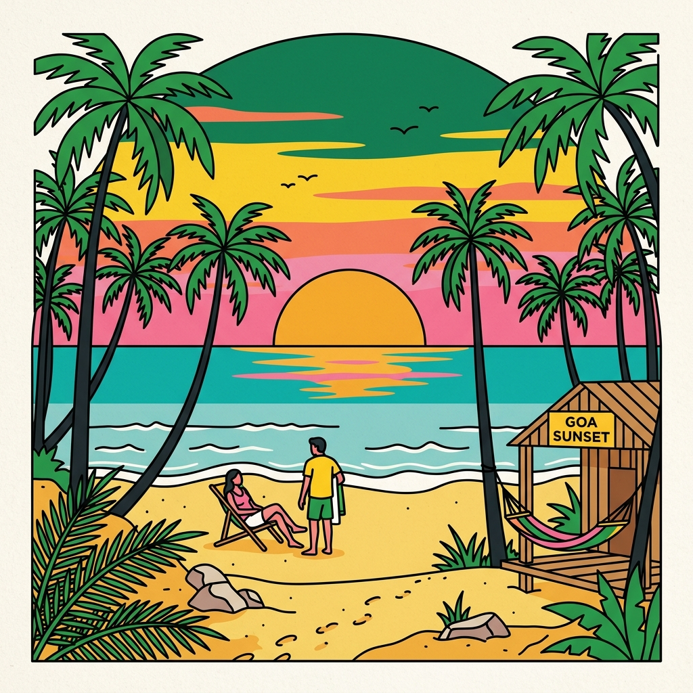

# Hacker House Goa 2026 - Builder ID Generator



The official **Hacker House Goa 2026** ID Card and Ticket generator. A premium, interactive web application that allows builders, hackers, and founders to generate a highly customized digital boarding pass, polaroid, or poster ID to share on X (Twitter).

Built specifically for the Goa 2026 Hacker House, capturing a unique visual identity that blends **Retro Goa**, **Hacker Culture**, **Vintage Travel**, and **Indie Editorials**.

### 🔗 [Live Demo](https://hh-goa-2026-sage.vercel.app/)

## Features

- **Dynamic Template Engine**: Choose from multiple premium visual layouts including Vintage Boarding Passes, Editorial Magazine Covers, Retro Polaroids, and Minimalist Stamps.
- **Custom Builder Details**: Personalize with your name, role, current project, and your core tech stack.
- **In-Browser Image Cropper**: Easily upload and adjust your profile picture directly in the browser to perfectly fit your chosen layout.
- **Vercel Blob Integration**: Seamlessly uploads generated canvases as high-quality images to Vercel Blob storage, ensuring persistent URLs.
- **Native Twitter (X) Integration**: Automatically constructs highly optimized Open Graph (OG) tags and redirects users to a pre-filled Twitter Composer featuring a massive native image preview.
- **Micro-Interactions**: Rich animations and smooth state transitions powered by Framer Motion.

## Tech Stack

- **Framework**: [Next.js 16](https://nextjs.org/) (App Router)
- **Styling**: [Tailwind CSS](https://tailwindcss.com/)
- **State Management**: [Zustand](https://github.com/pmndrs/zustand)
- **Canvas Rendering**: [html-to-image](https://github.com/bubkoo/html-to-image)
- **Animations**: [Framer Motion](https://www.framer.com/motion/)
- **Storage**: [Vercel Blob](https://vercel.com/docs/storage/vercel-blob)
- **Icons**: [Lucide React](https://lucide.dev/)

## Getting Started

### 1. Clone the repository
```bash
git clone https://github.com/your-username/hh-goa-2026.git
cd hh-goa-2026
```

### 2. Install dependencies
```bash
npm install
```

### 3. Configure Environment Variables
Create a `.env.local` file in the root of the project and add your Vercel Blob token. This token is required for the "Share to X" functionality to upload images.
```env
BLOB_READ_WRITE_TOKEN="your_vercel_blob_token"
```

### 4. Run the development server
```bash
npm run dev
```
Open [http://localhost:3000](http://localhost:3000) with your browser to see the generator in action.

## Deployment

This project is optimized for deployment on [Vercel](https://vercel.com).
To deploy:
1. Push your code to GitHub.
2. Import the repository in Vercel.
3. Attach a **Vercel Blob** database to your Vercel project (ensure the Access is set to **Public**).
4. Deploy!

## License

This project is licensed under the MIT License.

## Credits
Designed and Developed for @247pmstudio and the #HHGoa2026 community.
